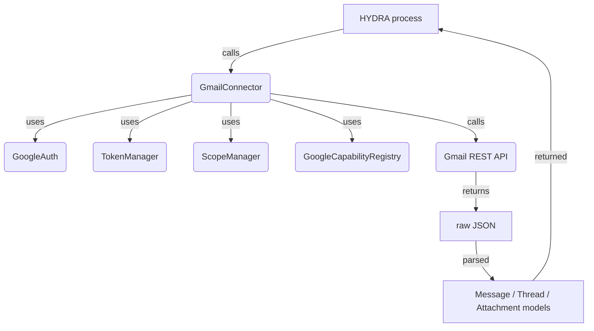

# Gmail Connector – Documentation

## 1. Overview
The **Gmail connector** is a reusable module within HYDRA that provides a high‑level,
type‑safe interface to the Gmail REST API. It does **not** implement its own OAuth
flow; instead it relies on the already‑frozen Google authentication stack:

* **GoogleAuth** – loads/stores credentials in the HYDRA Vault.
* **TokenManager** – refreshes access tokens when they expire.
* **ScopeManager** – translates *capabilities* (e.g. `read_mail`, `send_mail`) into the
  minimal OAuth scopes required by Google.
* **GoogleCapabilityRegistry** – the canonical source of Gmail’s semantic capabilities.
* **BrowserManager** – only needed for the *one‑time* bootstrap; after that the
  connector runs fully autonomously.

The connector is deliberately thin: it does not contain business logic beyond
calling the Gmail API and translating the HTTP responses into small Python data
classes (`Message`, `Thread`, `Attachment`).  All error handling, token renewal
and scope checking is delegated to the infrastructure described above.

## 2. Architecture Diagram

*All arrows represent dependency injection; the concrete implementations are
provided at construction time (or via the module defaults).*

## 3. Core Classes

### 3.1 `GmailConnector` (main entry point)
| Method | Description |
|--------|-------------|
| `health_check()` → `Dict[str, Any]` | Validates that a token is present, that the required scopes are granted,
  and that a lightweight API call (`users.getProfile`) succeeds. Returns a dict with
  keys ``valid``, ``message`` and ``missing_scopes``. |
| `list_messages(query="", max_results=10)` → `ListMessagesResponse` | List messages matching *query*. Returns a small model object that contains
  ``Message`` objects, a pagination token and an estimate count. |
| `send_mail(to, subject, body, cc=None, bcc=None)` → `Message` | Construct a MIME message, base64‑url‑encode it and call `messages.send`. Returns a
  ``Message`` model with the server‑assigned ``id`` and ``thread_id``. |
| `search(query)` → `List[Message]` | Delegates to ``list_messages`` with the given query and returns the list of
  ``Message`` objects. |
| `archive(message_id)` | Adds the ``ARCHIVE`` label (moves the message out of INBOX). |
| `add_labels(message_id, label_ids)` | Adds the supplied Gmail label IDs to the message. |
| `remove_labels(message_id, label_ids)` | Removes the supplied label IDs from the message. |
| `mark_as_read(message_id)` / `mark_as_unread(message_id)` | Add/remove the ``READ`` label. |
| `list_attachments(message_id)` → `List[Attachment]` | Stub that currently returns an empty list; can be overridden in a subclass
  to provide real MIME parsing. |
| `download_attachment(message_id, attachment_id)` → `bytes` | Retrieves the raw base64url‑encoded attachment data and decodes it. |
| `get_thread(thread_id)` → `Thread` | Returns a ``Thread`` object containing the first few messages of the given thread. |

### 3.2 `GmailService` (wrapper)
A tiny wrapper around the ``googleapiclient.discovery.Resource`` object.  It exists
only to hide the raw discovery client from the public API; callers interact
through ``GmailConnector``.

### 3.3 `GmailCapabilities` (static)
Holds the frozenset ``CAPABILITIES`` and provides helper methods
``capabilities_to_scopes`` and ``scopes_cover_capabilities``.  This class is the
single source of truth for *what* Gmail can do; the **ScopeManager** uses it to
compute the OAuth scopes that must be present in the token.

### 3.4 Exceptions (domain‑specific)
| Exception | When it is raised |
|-----------|-------------------|
| `TokenExpired` | No refresh token available or refresh failed. |
| `InsufficientPermissions` | The token lacks one of the scopes required for the operation (e.g. trying to send mail without ``gmail.send``). |
| `RateLimitError` | The API returned HTTP 429 or the error message mentions quota exhaustion. |
| `ConnectionError` / `TimeoutError` | Network problems, DNS failure, timeout while contacting Google. |
| `GmailApiError` | Any other HTTP error from the Gmail API (wraps the original ``HttpError``). |

## 4. Error‑Handling Strategy
1. **Token management** – `health_check()` calls ``_ensure_credentials()`` which, in turn,
   uses ``TokenManager`` to refresh the token if it is expired.  If refresh fails,
   ``TokenExpired`` is raised.
2. **Scope validation** – before any API call the connector checks that the token’s
   scopes (retrieved via ``ScopeManager._required_scopes_for_modules()``) cover the
   operation’s requirements.  If not, ``InsufficientPermissions`` is raised.
3. **HTTP‑error mapping** – every ``HttpError`` from the Google client is translated
   into one of the domain exceptions listed above.  The mapping is performed in
   ``_map_http_error`` and considers the HTTP status code and the error message
   returned by Google.
4. **Graceful degradation** – methods such as ``list_attachments`` are deliberately
   stubbed so that the connector can be imported and used even if full MIME parsing
   is not yet implemented.  Subclasses can override them.

## 4. Usage Examples

### 4.1 Minimal bootstrap (one‑time)
```bash
# On a machine with a browser:
python -m src.hydra.google.gmail.__main__   # calls BrowserManager.start_bootstrap()
# After the first run the refresh token lives in the Vault.
```

### 4.2 Using the connector from Python
```python
from hydra.google.gmail import GmailConnector, health_check

conn = GmailConnector()                # reads token from Vault automatically
if conn.health_check()["valid"]:
    # List the last 5 messages
    msgs = conn.list_messages(max_results=5)
    for m in msgs.messages:
        print(f"{m.subject} (id={m.id})")

    # Send a simple mail
    sent = conn.send_mail(
        to="friend@example.com",
        subject="Hello from HYDRA",
        body="Just saying hello!"
    )
    print(f"Sent message id={sent.id}")

    # Archive a message
    conn.archive(message_id="12345abcdef")
```

### 4.3 Checking capabilities without touching scopes
```python
from hydra.google.gmail import GmailCapabilities, scopes_cover_capabilities

caps = GmailCapabilities()
# Suppose the token only has read access:
token_scopes = {"https://www.googleapis.com/auth/gmail.readonly"}
print(scopes_cover_capabilities(token_scopes, caps.all))   # False
# After granting send permission:
token_scopes.add("https://www.googleapis.com/auth/gmail.send")
print(scopes_cover_capabilities(token_scopes, caps.all))   # True
```

### 4.4 Integration with ARGOS
ARGOS can query the connector’s public surface to decide what actions are allowed:
```python
from hydra.google.gmail import GmailConnector, GmailCapabilities

conn = GmailConnector()
caps = GmailCapabilities().all
# ARGOS can now ask: "does HYDRA have the capability to send mail?"
has_send = "send_mail" in caps  # True if the token includes the proper scope.
```
Because the connector internally uses ``ScopeManager`` to map capabilities → scopes,
ARGOS never needs to know the exact OAuth scope strings.

## 5. Development & Testing

### 5.1 Adding a new capability
1. Extend ``CAPABILITIES`` in ``src/hydra/google/gmail/gmail_capabilities.py``
   (add the new semantic name).
2. Add the corresponding method to ``GmailConnector`` (e.g. ``send_draft`` if
   Google ever adds a draft‑sending API – not needed for v1).
3. Update ``ScopeManager._required_scopes_for_modules()`` if the new capability
   has a mandatory OAuth scope; otherwise leave it out and the connector will
   simply not request it.

### 5.2 Running the unit tests
```bash
cd /home/genesis/opt/genesis/HYDRA
python -m pytest tests/gmail_connector_test.py -v
```
The test suite mocks the Google API client and validates the error‑mapping
logic, the health‑check flow and the basic CRUD operations.

### 5.3 Continuous Integration
The project's CI pipeline runs a ``public_api_frozen_check`` job that fails if any
of the following files are modified without a corresponding major version bump:
* ``src/hydra/browser/manager.py`` (BrowserManager)
* ``src/hydra/google/auth.py`` (Google Auth)
* ``src/hydra/google/capabilities.py`` (GoogleCapabilityRegistry)

The same job checks that the Gmail connector's public methods retain their
signatures.

## 6. Roadmap (beyond v1.0)
* **Drive connector** – reuse the same pattern, add `upload`, `download`, `share`.
* **Calendar connector** – add `create_event`, `update_event`, `read_events`.
* **YouTube connector** – add `upload_video`, `list_playlists`, `search_channels`.
* **Full MIME‑parse for attachments** – integrate a library such as ``email`` or
  ``email‑validator`` to populate ``Attachment`` objects automatically.

*All future work follows the "extension, not rupture" rule: new services are
registered in the **GoogleCapabilityRegistry** and new *GoogleModule* subclasses
are added; no public API signatures are altered until a major version bump.*

---
*Document generated for HYDRA v1.0 – architecture frozen.  For the latest
updates see the repository's ``ARCHITECTURE.md`` and ``VERSIONING.md`` files.*